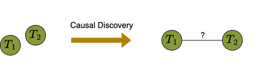

---
title: 'Sequential Non-Ancestor Pruning'
date: 2024-02-07
type: landing

design:
  spacing: '0rem'

params:
  footer:
    copyright:
      notice: '© {year} Me. This work is license uder {license}'
      license:
        enable: false
  header:
    navbar:
      enable: false


# Page sections
sections:
  ###### Title ######
  - block: markdown
    content:
      text: |-
        <span class="snap">
          <p style="font-size: 200%; max-width: 50rem;">SNAP: Sequential Non-Ancestor Pruning for Targeted Causal Effect Estimation</p>        
          
          <a href="https://matyasch.github.io/" target="_blank">Mátyás Schubert</a><sup>1</sup>,
          <a href="https://www.cs.ru.nl/~tomc/" target="_blank">Tom Claassen</a><sup>2</sup>,
          <a href="https://saramagliacane.github.io/" target="_blank">Sara Magliacane</a><sup>1</sup>,
          <br>
          <sup>1</sup>University of Amsterdam
          <br>
          <sup>2</sup>Radboud University Nijmegen

          Artificial Intelligence and Statistics (AISTATS), 2025

          <a href="https://arxiv.org/abs/2502.07857" target="_blank" class="snap-btn"><i class="fa-solid fa-file-pdf"></i> Paper</a>
          <a href="https://github.com/matyasch/SNAP" target="_blank" class="snap-btn"><i class="fa-solid fa-code"></i> Code</a>
          <a href="snap.pdf" target="_blank" class="snap-btn"><i class="fa-solid fa-chalkboard-user"></i> Slides</a>
        </span>
    design:
      background:
        color: rgb(255, 252, 240)
  ###### Teaser ######
  - block: markdown
    content:
      text: |-
        <video width=50% controls autoplay muted><source src="snap_intro.mp4" type="video/mp4"></video>
    design:
      css_style: "padding-bottom: 2rem"
      background:
        color: rgb(255, 252, 240)
  ###### Abstract ######
  - block: markdown
    content:
      text: |-
        <span class="snap">
          <p class="project-title">Abstract</p>
          <p class="project-abstract">
            Causal discovery can be computationally demanding for large numbers of variables. If we only wish to estimate the causal effects on a small subset of target variables, we might not need to learn the causal graph for all variables, but only a small subgraph that includes the targets and their adjustment sets. In this paper, we focus on identifying causal effects between target variables in a computationally and statistically efficient way. This task combines causal discovery and effect estimation, aligning the discovery objective with the effects to be estimated. We show that definite non-ancestors of the targets are unnecessary to learn causal relations between the targets and to identify efficient adjustments sets. We sequentially identify and prune these definite non-ancestors with our Sequential Non-Ancestor Pruning (SNAP) framework, which can be used either as a preprocessing step to standard causal discovery methods, or as a standalone sound and complete causal discovery algorithm. Our results on synthetic and real data show that both approaches substantially reduce the number of independence tests and the computation time without compromising the quality of causal effect estimations.
          </p>
        </span>
    design:
      background:
        color: rgb(242, 240, 229)
  ###### Task ######
  - block: markdown
    content:
      text: |-
        <span class="snap">
          <p class="project-title">Targeted Causal Effect Estimation with an Unknown Graph</p>
          <p class="project-paragraph">
            Estimating causal effects, for example to understand how human activities drive climate change, is fundamental to our scientific understanding and practical decision-making.
            The gold standard for this is to conduct experiments, but these can be expensive or unethical.
            For instance, deliberately increasing greenhouse gas emissions to study their effects would be irresponsible.
            Fortunately, causal effects can also be estimated from observational data, using adjustment variables.
            These <i>adjustment sets</i> are determined by the causal graph of the underlying process, which can also be estimated by causal discovery methods.
          </p>
          <div class="project-figure">
            
            <i><b>Causal discovery</b> estimates the causal graph, from which valid adjustment sets can be read off for causal effect estimation.</i>
          </div>
          <p class="project-paragraph">
            However, discovering the full causal graph can be computationally expensive for large numbers of variables.
            If we are only interested in the causal effects between a small set of <i>target variables</i>, we may not need to learn the entire causal graph, but just a smaller subgraph that includes the targets and their statistically efficient adjustment sets.
          </p>
          <div class="project-figure">
            
            <i><b>Removing</b> $V_3$ and $V_5$ in the previous example decrases the cost of causal discovery, while yielding the same efficient adjustment sets.</i>
          </div>
          <p class="project-paragraph">
            We formalize this problem as targeted causal effect estimation with an unknown graph, which focuses on identifying the causal effects between all pairs of target variables in a <i>computationally and statistically efficient way</i>.
          </p>
        </span>
    design:
      background:
        color: rgb(255, 252, 240)
  ###### Non-ancestors ######
  - block: markdown
    content:
      text: |-
        <span class="snap">
          <p class="project-title">Possible Ancestors are All You Need</p>
          <p class="project-paragraph">
            Discovering uninformative parts of the causal graph wastes computational resources.
            Conversely, removing all non-target variables risks confounded causal effects and fewer identifiable causal relations.
            Even with hints about a valid adjustment set, causal discovery might still not be able to verify all relevant causal relations.
          </p>
          <div class="project-figure" style="display: flex;">
            <div class="project-figure" style="max-width: 45%;">
              
              <i>Considering <b>only the targets</b> for causal discovery might not identify their causal relations or valid adjustment sets.</i>
            </div>
            <div class="project-figure" style="max-width: 45%;">
              
              <i>Also considering a <b>valid adjustment set</b> for causal discovery might still not identify all relevant causal relations.</i>
            </div>
          </div>
          <p class="project-paragraph">
            Our goal is to find a small subset of variables, such that causal discovery on this subset still identifies efficient adjustment sets the same way as discovering the full graph would.
            To this end, we show that definite non-ancestors of the targets can be safely removed, leaving only the set of possible ancestors, which always contains all efficient adjustment sets. 
            While finding the exact set of possible ancestors might require reconstructing the full graph, we can overestimate it with a <i>possibly ancestral set</i>, i.e. a set of variables that also contains all possible ancestors of the variables in it.
            We prove that causal discovery on a possibly ancestral set yields the same graph as first discovering the full graph and then restricting it to the possibly ancestral set.
          </p>
          <div class="project-figure">
            
              <i>Causal discovery on a <b>possibly ancestral set</b> yields the same graph as first discovering the full graph and then restricting it to that set.</i>
          </div>
          <p class="project-paragraph">
            if the possibly ancestral set is significantly smaller than the total number of variables, we can save substantial computational effort without sacrificing the quality of adjustment sets.
            The challenge is efficiently identifying as many definite non-ancestors as possible.
          </p>
        </span>
    design:
      background:
        color: rgb(242, 240, 229)
  ###### SNAP ######
  - block: markdown
    content:
      text: |-
        <span class="snap">
          <p class="project-title">Sequential Non-Ancestor Pruning</p>
          <p style="max-width: 80rem; text-align: justify;">
            We introduce Sequential Non-Ancestor Pruning (SNAP), which iteratively identifies and removes definite non-ancestors, and provide two implementations: SNAP$(k)$ and SNAP$(\infty$).
            SNAP$(k)$ is a constraint-based causal discovery algorithm that adapts the PC-style skeleton search.
            It iteratively increases conditioning set sizes of conditional independence (CI) tests starting from order 0.
            At every iteration, it orients v-structures using the intermediate skeleton and discovered separating sets to identify and prune some definite non-ancestors of the targets before proceeding to the next iteration.
          </p>
          <div class="project-figure">
            
              <i><b>SNAP$(k)$</b> progressively identifies and prunes non-ancestors by orienting v-structures at every order of the PC-style skeleton search.</i>
          </div>
          <p style="max-width: 80rem; text-align: justify;">
            Orienting v-structures based with intermediate skeletons and CI test results restricted to a maximum order requires particular care.
            For instance, we need to handle conflicting v-structures, and additional steps are needed for proper orientation starting from order 2.
            We discuss these details and provide the complete pseudocode in the full paper.
          </p>
          <p style="max-width: 80rem; text-align: justify;">
            SNAP$(k)$ considers fewer and fewer variables as conditioning set sizes increase, reducing higher-order CI tests significantly.
            We can stop SNAP$(k)$ at any iteration $k$ and run a standard causal discovery algorithm on the remaining variables, which always form a possibly ancestral set, to identify valid and efficient adjustment sets.
            We call this approach prefiltering with SNAP$(k)$.
          </p>
          <div class="project-figure">
            
              <i><b>Prefiltering</b> with SNAP$(k)$ can efficiently reduce the number of variables before causal discovery.</i>
          </div>
          <p style="max-width: 80rem; text-align: justify;">
            SNAP$(\infty)$ extends SNAP$(k)$ into  a stand-alone causal discovery algorithm.
            It runs SNAP$(k)$ <i>until completion</i>, then applies Meek's rules, and identifies and removes non-ancestors one final time.
            The result is the full graph restricted to the possible ancestors of the targets, ensuring the same valid and efficient adjustment sets as full-graph discovery.
          </p>
          <div class="project-figure">
            <video width=80% controls muted><source src="snap_vs_pc.mp4" type="video/mp4"></video>
            <i><b>SNAP$(\infty)$ needs much fewer CI tests</b> than PC to find <span style="color: rgb(32, 94, 166)">optimal adjustment sets</span> for the causal effects between <span style="color: rgb(102, 128, 11)">targets</span>, by progressively removing <span style="color: rgb(175, 48, 41)">definite non-ancestors</span>.</i>
          </div>
          <br>
        </span>
    design:
      background:
        color: rgb(255, 252, 240)
  ###### Experiments ######
  - block: markdown
    content:
      text: |-
        <span class="snap">
          <p class="project-title">Experiments</p>
          <p style="max-width: 80rem; text-align: justify;">
            We compare SNAP$(\infty)$ with global and local causal discovery algorithms on synthetic and semisynthetic graphs across multiple domains.
            SNAP$(\infty)$ consistently ranks among the best in the number of CI tests and computation time, while maintaining a comparable intervention distance.
            Other methods vary in performance depending on the domain.
          </p>
          <div class="project-figure">
            
              <i><b>Number of CI tests and computation time</b> over synthetic graphs with different number of nodes and 4 targets.</i>
          </div>
          <div style="display: flex; margin: auto; max-width: 80rem; justify-content: center;">
            <div style="max-width: 45%; text-align: justify;">
              <p style="max-width: 80rem; text-align: justify;">
              On the right, we show that prefiltering with SNAP(0) substantially speeds up discovery.
              Increasing the prefiltering iterations $k$ further reduces the number of CI tests, especially in denser graphs.
              SNAP variants also demonstrate significant efficiency gains on semi-synthetic data generated from the MAGIC-NIAB network.
              </p>
              <div class="project-figure">
                
                <i>Results for the <b>MAGIC-NIAB network</b> using semi-synthetic data.</i>
              </div>
            </div>
            <div class="project-figure" style="max-width: 45%;">
              
                <i><b>Difference</b> in time between with and without prefiltering with SNAP(0).</i>
            </div>
          </div>
          <br>
        </span>
    design:
      background:
        color: rgb(242, 240, 229)
  ###### Outro ######
  - block: markdown
    content:
      text: |-
        <span class="snap">
        <span style="font-size: 160%;">Citation</span>

        ```bib
        @inproceedings{schubert2025snap,
            title={{SNAP}: Sequential Non-Ancestor Pruning for Targeted Causal Effect Estimation With an Unknown Graph},
            author={M{\'a}ty{\'a}s Schubert and Tom Claassen and Sara Magliacane},
            booktitle={The 28th International Conference on Artificial Intelligence and Statistics},
            year={2025},
            url={https://openreview.net/forum?id=0gEjlLdjK9}
        }
        ```
        </span>
    design:
      css_style: "text-align: left; padding-bottom:10rem"
      background:
        color: rgb(255, 252, 240)
---